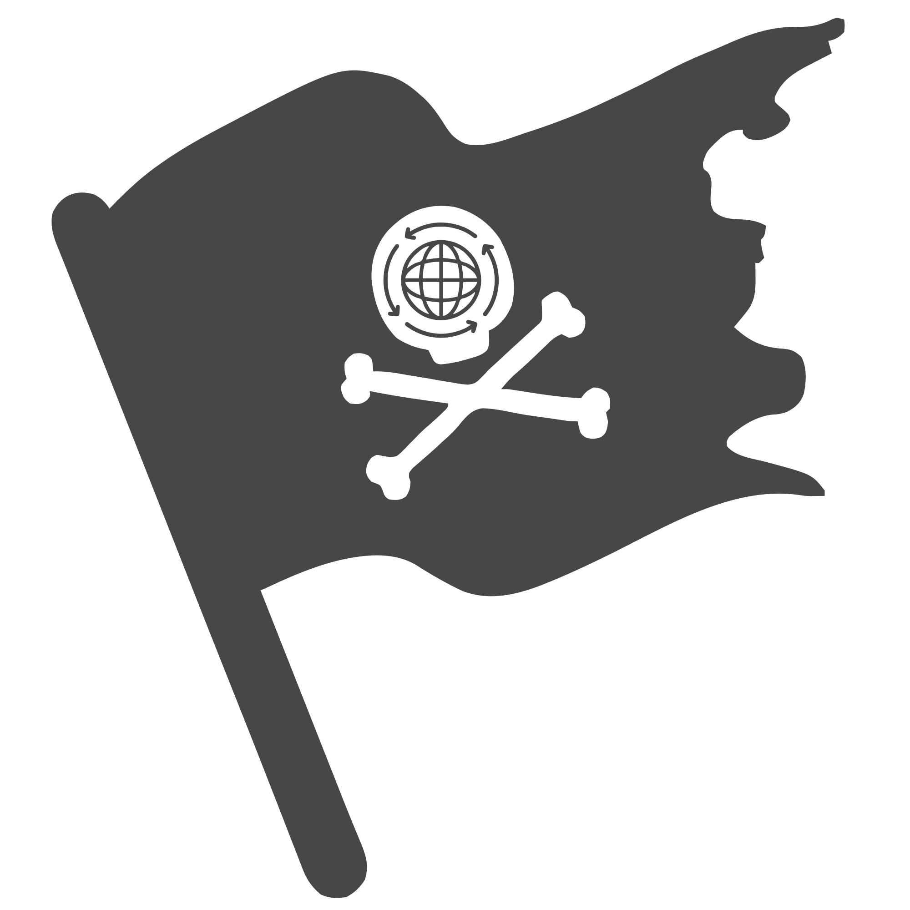

# @lanun/antarabangsa-next

[](https://github.com/syfqpie/lanun)

<p align="center">
  
</p>

Internationalization (i18n) library for Next.js apps.

## Table of Contents

- [Installation](#installation)

## Installation

To add **@lanun/antarabangsa-next** to your project, install it via npm (or your preferred package manager):

```bash
npm install @lanun/antarabangsa @lanun/antarabangsa-next

or

yarn add @lanun/antarabangsa @lanun/antarabangsa-next

or

pnpm add @lanun/antarabangsa @lanun/antarabangsa-next
```

## Usage

Check out the [documentation](https://antarabangsa.cendol.dev)
